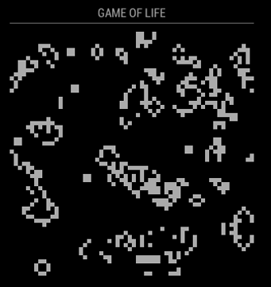
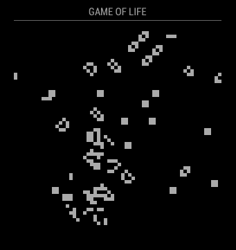

# MMM-GameOfLife

[](https://codeclimate.com/github/raywo/MMM-GameOfLife/maintainability)
[](https://codeclimate.com/github/raywo/MMM-GameOfLife/test_coverage)
[](https://snyk.io/test/github/raywo/mmm-GameOfLife?targetFile=package.json)
[](https://david-dm.org/raywo/MMM-GameOfLife)
[](https://gitter.im/raywo)

MMM-GameOfLife is probably one of the most useful modules for [MagicMirror<sup>2</sup>](https://github.com/MichMich/MagicMirror) project by [Michael Teeuw](https://github.com/MichMich). It displays a game of life with continously developing generations.

## How it works

Conway’s Game of Life is a zero-player game. It’s evolution is determined by its initial state, requiring no further input. The most interesting fact about this game is that it represents another computability model. In fact MagicMirror<sup>2</sup> could be programmed by using the Game of Life. If you want more about the Game of Life you can start [here](https://en.wikipedia.org/wiki/Conway%27s_Game_of_Life).

To show how the game evolves MMM-GameOfLife uses the [p5.js](https://p5js.org) framework to display the game grid. As soon as a new generation of the play grid is computed the new state is drawn. The computation of a new generation and the drawing of it happen in an infinite loop as fast as the underlying computer can. Although this looks very nice it may overheat your Raspberry Pi. You can limit the new calculations by using the `desiredFrameRate` property in the module’s config. A setting between `5` and `10` yields nice results without using too much CPU power.

The game will fill the playing grid with random living cells. Then it starts the evolution. Most of this configurations will result in an oscilation state after some generations. This means there will be no real movement on the screen since state A switches to state B and state B switches back to state A. Whenever the module detects this condition it restarts the game with a new set of random living cells.


## Screenshots

  


## Preconditions

* MagicMirror2 instance
* Node.js version >= 7
* npm


## Installation

Just clone the module into your MagicMirror’s modules folder and execute `npm install` in the module’s directory:

```bash
git clone https://github.com/raywo/MMM-GameOfLife.git
cd MMM-GameOfLife
npm install
```

## Updating

Updating is as easy as navigating to the module’s folder, pull the latest version from GitHub and install.

```bash
git pull
npm install
```


## Configuration

You may configure the look an feel of your Game of Life instance.

| Option | Description |
| ------ | ----------- |
| `desiredFrameRate` | An integer describing how many new generation should be computed and displayed per second. <br><br>**Type:** `integer` **optional** <br>**Example:** `3` (Three new generations per second are drawn.)<br>**Default value:** `1` <br><br>**Note:** Keep in mind that a higher frame rate brings more “life” to the game but it also increases the CPU usage which may overheat your Pi! |
| `resolution` | An integer describing the size of a cell in the game’s grid. <br><br>**Type:** `integer` **optional** <br>**Example:** `5` (A cell is 5x5 pixels in size.)<br>**Default value:** `10` <br><br>**Note:** Please keep in mind that a small value for `resolution` will result in many cells which need to be computed. That can leed to high CPU usage! The smallest possible value for `resolution` is `2`. |
| `canvasWidth` | An integer describing the width in pixels of the game’s grid. <br><br>**Type:** `integer` **optional** <br>**Example:** `250` (Grid with 250px width. With `resolution` set to `5` fifty columns are generated.)<br>**Default value:** `300`<br>**Possible  Values:** values `>= 50` <br><br>**Note:** This value is an absolute measure. If you set this value too high the game’s grid may overlap other modules besides itself.|
| `canvasHeight` | An integer describing the height in pixels of the game’s grid. <br><br>**Type:** `integer` **optional** <br>**Example:** `250` (Grid with 250px width. With `resolution` set to `5` fifty rows are generated.)<br>**Default value:** `300` <br>**Possible  Values:** values `>= 50`<br><br>**Note:** This value is an absolute measure. If you set this value too high the game’s grid may overlap other modules besides itself.|
| `notAliveColorCode` | A string representing a valid html color which is used for dead cells. <br><br>**Type:** `string` **optional** <br>**Example:** `"gray"` <br>**Default value:** `#000` <br><br>**Note:** Use either a color name like `red` or `lightgray` or a hexcode like `#121212`. If you want to use a _transparent background_ set this option to `"transparent"`. |
| `aliveColorCode` | A string representing a valid html color which is used for living cells. <br><br>**Type:** `integer` **optional** <br>**Example:** `"#04a515"` (Living cells are displayed in a green color.)<br>**Default value:** `#aaa` <br><br>**Note:** Use either a color name like `red` or `lightgray` or a hexcode like `#121212` |


## Notes

This module was inspired by a coding challenge on [YouTube](http://www.youtube.com/watch?v=FWSR_7kZuYg). At first I set out to improve the code given in this challenge. After it came to live on my computer I thought it would be nice if it ran on my Magic Mirror so I made this module.

[](http://www.youtube.com/watch?v=FWSR_7kZuYg "Coding Challenge #85: The Game of Life")

It was interesting to include the p5js library into this module and write nice code. I think I ended up with not the most beautiful code. All logic happens in that `makeSketch` function. But I couldn’t think of a better way to write that code while giving it access to the `config` at the same time.

If anyone has a better way to solve this problem feel free to improve my code and give me a notice.


## Contributing

If you find any problems, bugs or have questions, please open a [GitHub issue](https://github.com/raywo/MMM-GameOfLife/issues) in this repository.

